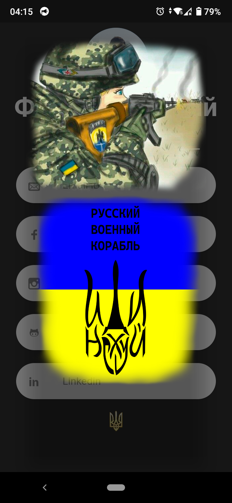

<p align="center"></p>
<h1 align="center">FutureMyNotes</h1>

## Description
<b>EN:</b>

This is my coursework created for **Android** and **iOS** using the [**Flutter**](https://flutter.dev) framework. The project is notes with text and pictures.

<b>UA:</b>

Це моя курсова робота, створена для **Android** та **iOS** на фреймворку [**Flutter**](https://flutter.dev). Проект представляє собою нотатки з текстом і картинками.

#
## Screenshots
<p>
  
  
  
  
  
  
  
  
  
  
  
  
</p>

#
## Technologies used
<b>EN:</b>
- Using the [**Flutter**](https://flutter.dev) framework
- Saving images via **Base64** in **JSON** format
- Working with the **JSON** format parsing into a regular object
- Working with files
- Information search

<b>UA:</b>
- Використання фреймворку [**Flutter**](https://flutter.dev)
- Зберігання зображень через **Base64** в формат **JSON**
- Робота з форматом **JSON** парсинг в звичайний об'єкт
- Робота з файлами
- Пошук інформації

#
## License
```
© 2022, CoolOtaku (ericspz531@gmail.com)
```
